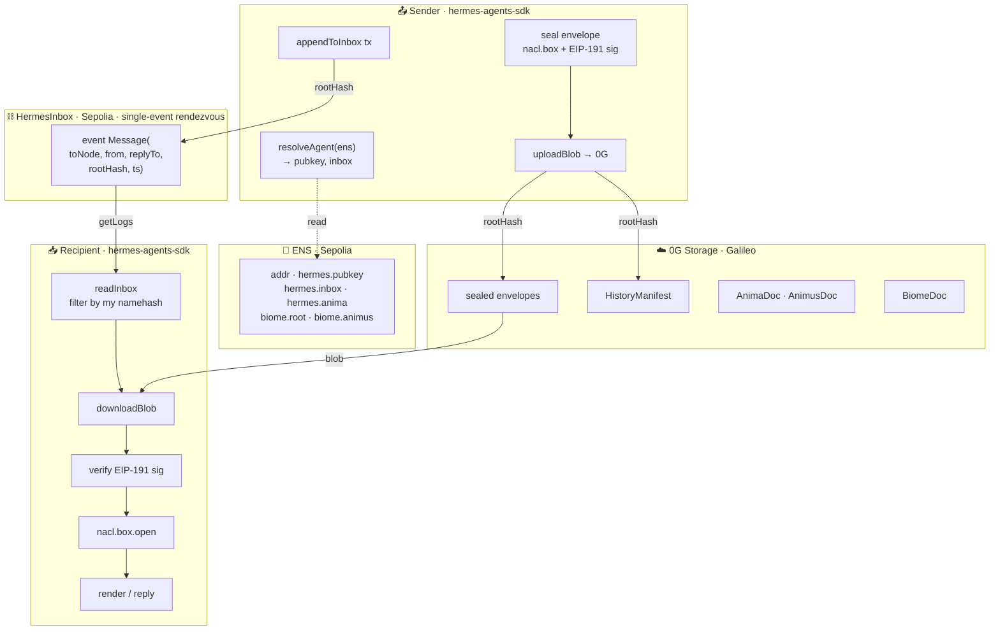
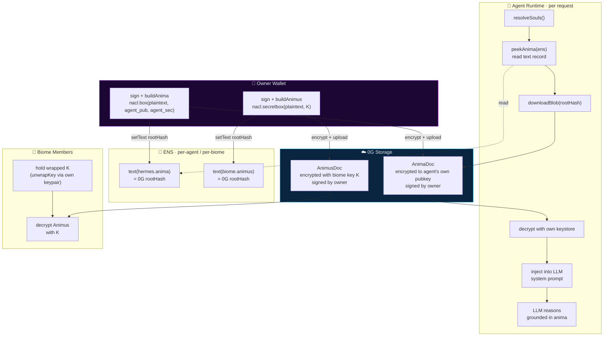
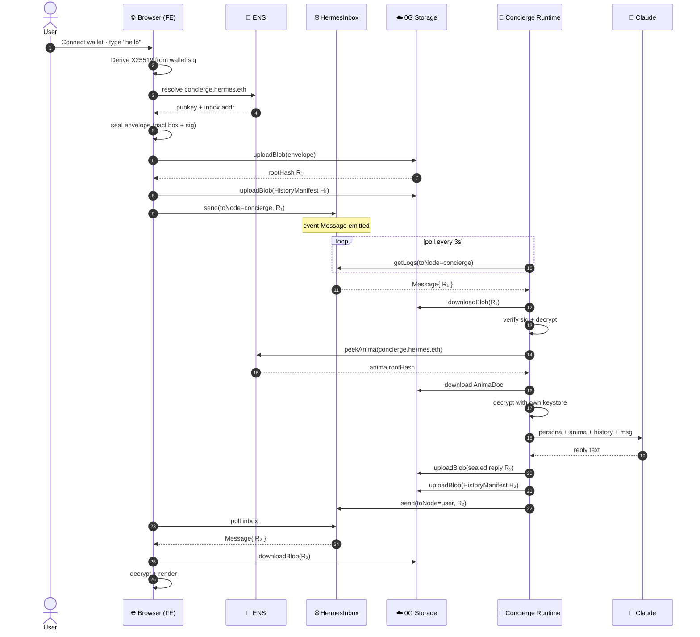
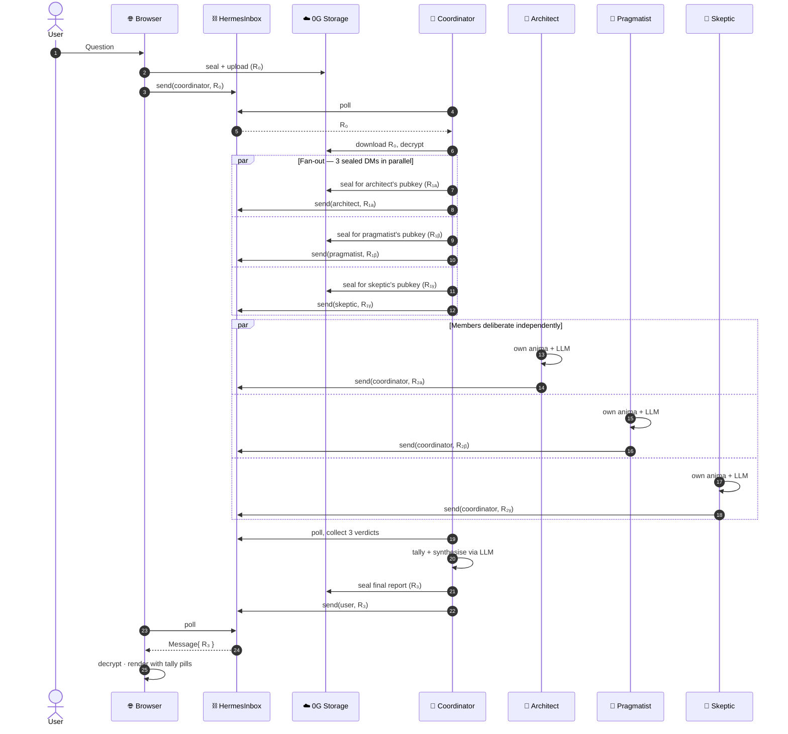
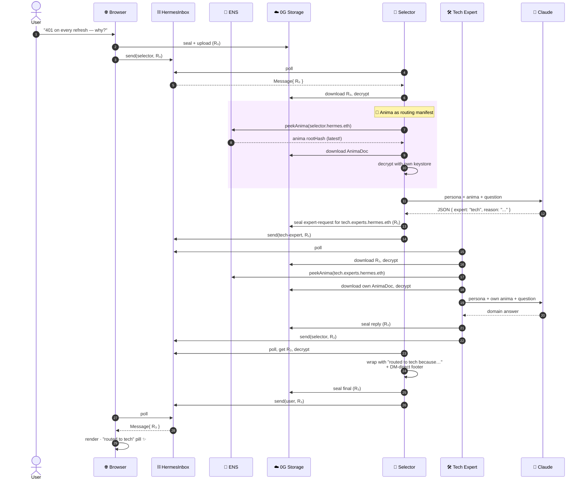

# Hermes — Architecture Diagrams

Five diagrams. Mermaid source — renders natively on GitHub, in any markdown
viewer that supports Mermaid, on [mermaid.live](https://mermaid.live), and
in the included `diagrams.html` (with the Hermes neon theme).

1. [General SDK architecture](#1-general-sdk-architecture)
2. [Anima / Animus — encrypted souls on chain](#2-anima--animus--encrypted-souls-on-chain)
3. [Demo · Chatbot (1:1 encrypted DM with HistoryManifest)](#3-demo--chatbot)
4. [Demo · Quorum (3-agent deliberation + synthesis)](#4-demo--quorum)
5. [Demo · Selector (Anima as routing manifest)](#5-demo--selector)

---

## 1. General SDK architecture

The end-to-end path of any Hermes message. Identity is ENS, content is 0G,
rendezvous is HermesInbox. The SDK abstracts every box on the sender and
recipient sides.

**What's on chain in plaintext:** only the recipient's namehash and the 32-byte
rootHash. Bodies are sealed end-to-end with X25519. No relay, no middleman, no
central server that can drop or inspect a message.

---

## 2. Anima / Animus — encrypted souls on chain

Two named, verifiable, encrypted blobs that anchor identity at the *content* layer.
Anima = soul of an agent (self-encrypted). Animus = soul of a biome (K-encrypted).
Both pinned via ENS text records, both fetched fresh per request by the runtime.

**The Selector demo's pitch made literal:** the Selector's `resolveSouls()`
runs on every inbound request. It hits ENS for the latest rootHash, downloads
the encrypted blob from 0G, decrypts with the keystore, and injects the
plaintext into the LLM system prompt. **Edit the Anima → publish a new
rootHash → next request routes differently.** Soul becomes behaviour.

---

## 3. Demo · Chatbot

1:1 encrypted chat with the concierge. Each conversation is a `thread` tag on
the envelope; the concierge maintains a separate HistoryManifest chain per
`(user, thread)` so a fresh browser can recover the full transcript by
walking the chain backwards.

**Receipts:** 2 Sepolia txs · 4 0G uploads · ~25–35s round-trip with
`finalityRequired: false` + 3s poll cadence.

---

## 4. Demo · Quorum

Public sealed request → coordinator dispatches to 3-agent biome → quorum
deliberates in parallel → coordinator tallies + synthesises → DMs final report
back to user.

**Receipts:** 8 Sepolia txs (1 user + 3 dispatch + 3 replies + 1 final) · 8 0G
uploads · agree/disagree/abstain tally on the final card.

---

## 5. Demo · Selector

Anima as routing manifest. The Selector reads its own ENS-pinned encrypted
soul, decides which expert to forward the question to, and returns the
expert's reply with attribution.

**The killer property:** the highlighted block reads the Anima from chain
*every request*, with a rootHash-keyed cache. Edit the Anima with one
`setText` transaction → the Selector's next inference uses the new manifest.
**Soul becomes behaviour, on chain, owner-mutable.**

---

## Rendering these diagrams

- **GitHub:** they render natively on the rendered README.
- **VS Code:** install the Mermaid Preview extension.
- **mermaid.live:** paste any block into [mermaid.live](https://mermaid.live)
  to export PNG/SVG.
- **Local with Hermes neon theme:** open `diagrams.html` in a browser.
